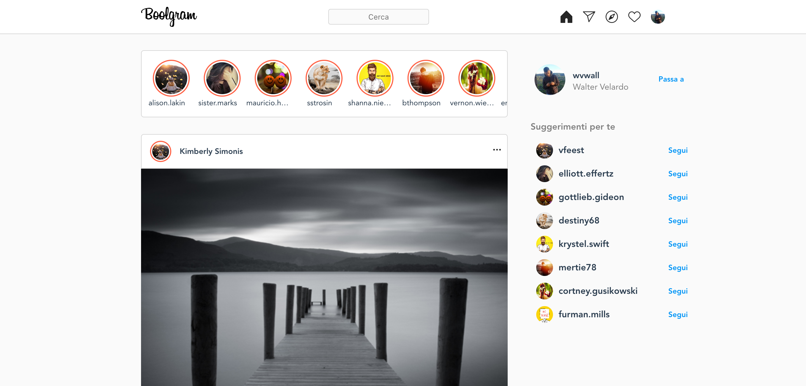
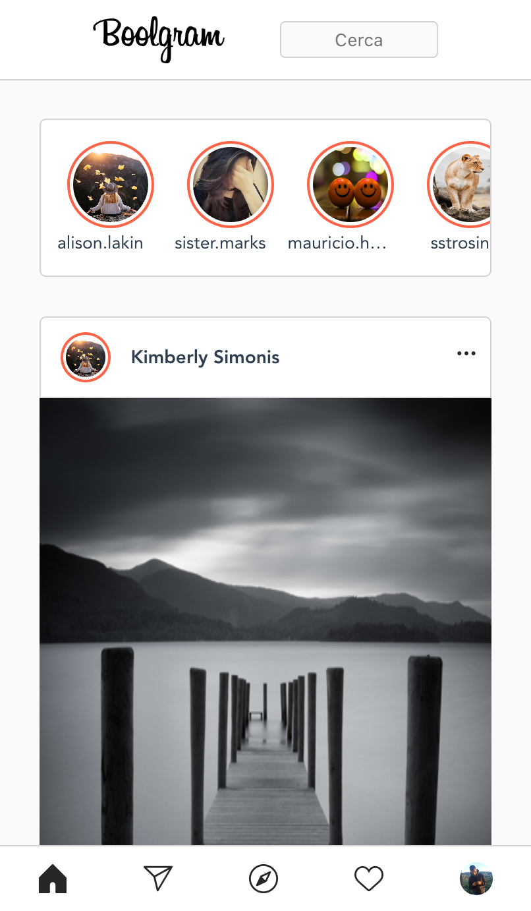

# boolgram

## Descrizione Progetto

In questo esercizio post corso creeremo un'applicazione che replica il funzionamento di **Instagram Web**.
In particolare creeremo il blocco delle storie e dei post presi da una API, e profili di conoscenti.

Per poter affrontare questo esercizio sarà necessario saper utilizzare:
Vue Cli - [https://cli.vuejs.org/](https://cli.vuejs.org/)
Componenti Vue
Js
Scss

Video propedeutici:
[Vue Cli](https://www.notion.so/Vue-Cli-Creare-un-nuovo-progetto-022eaefedfbe45928d50a9b5563fcafa)

### Milestone 1

Per prima cosa dovrai creare il layout, utilizzando dei dati _finti_ e solo dopo sostituirli con quelli che arrivano dall’Api.

Lavorativamente si fa proprio così:
si crea un mockup in modo da potersi concentrare sul layout eliminando la parte più complessa della logica.

Quanti e quali componenti creare è a tua discrezione, ma per una più semplice scrittura della parte logica che farai più avanti il nostro consiglio è di avere questa alberatura (clicca sulle frecce per espandere):

- App

  Nav

  - Blocco Principale

    - Parte Sinistra

      - Blocco Storie

        Singola Storia

      - Blocco Post

        Singolo Post

    - Parte Destra

      Profilo
      Suggerimenti
      Footer

Una volta che il layout è fatto, se è stato creato bene l’html tutto sarà in discesa.

### Milestone 2

Aggiungi una chiamata asincrona per popolare le storie al seguente link:
[https://flynn.boolean.careers/exercises/api/boolgram/profiles](https://flynn.boolean.careers/exercises/api/boolgram/profiles)

Non saranno vere e proprio storie, non si aprirà alcunché, ma saranno meno statiche di prima.
Usa lo stesso link per popolare i suggerimenti a destra.

### Milestone 3

Popola i post usando questo link
[https://flynn.boolean.careers/exercises/api/boolgram/posts](https://flynn.boolean.careers/exercises/api/boolgram/posts)

Ci sono tante parti da curare in questo caso:

- Nome intero
- Foto profilo
- Immagine post
- Quante persone hanno messo like
- Testo del post
- Numero commenti totale e primi 3 commenti

### Milestone 4

Cliccando su “Visualizza più commenti” fai vedere tutti i commenti restanti

### Milestone 5

Aggiungiamo un effetto **skeleton loading**.

**In cosa consiste?**

Prima che i dati siano effettivamente disponibili, mostriamo uno scheletro di come si visualizzerà il contenuto, aggiungendo un pizzico di animazione con css.

L’animazione dovrà sparire quando i dati saranno stati recuperati dall’Api.

_Piccolo consiglio, se la chiamata è così veloce da non consentirci il test, possiamo simulare noi il ritardo!_

### Possibili Bonus

Ci sono tante parti che puoi espandere e il consiglio è quello di lasciarti guidare dalla fantasia e da idee che hai in testa, ma se dovessi non avere alcuna idea, qua ne puoi trovare qualcuna:

- Le storie si aprono e visualizzano un’immagine
- Puoi aggiungere un commento
- Caricare meno post, quando si arriva alla fine dello scroll se ne caricano altri
